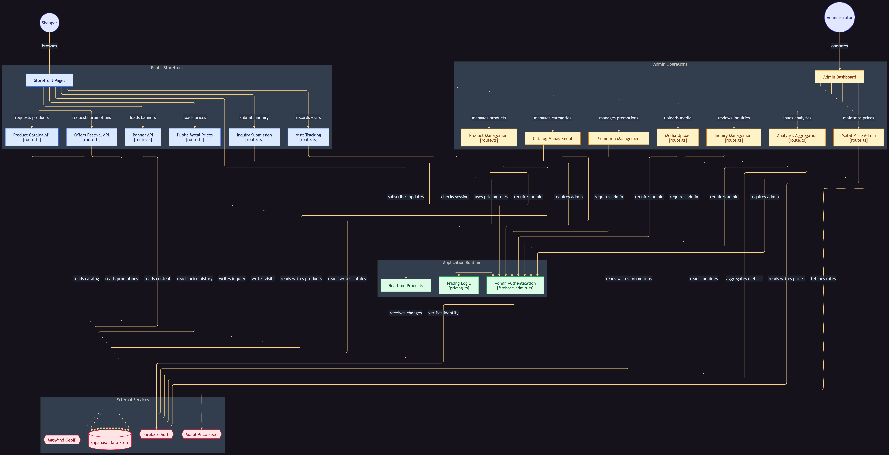
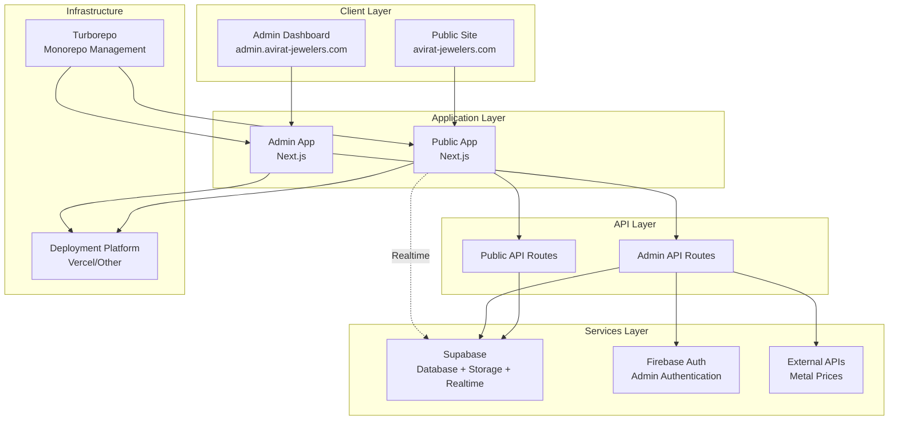
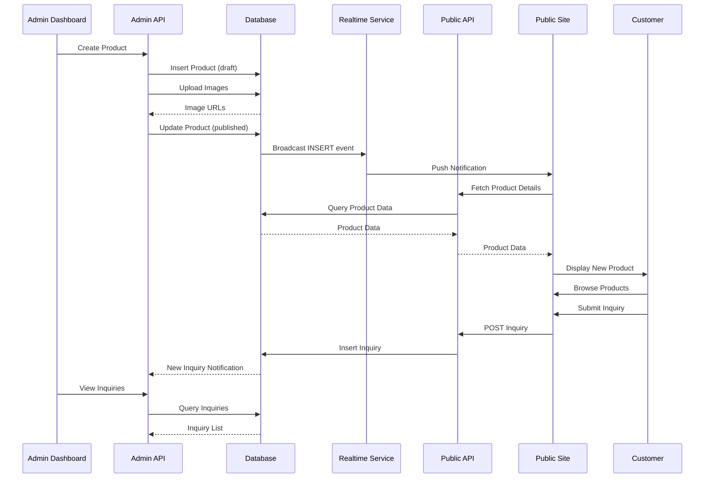
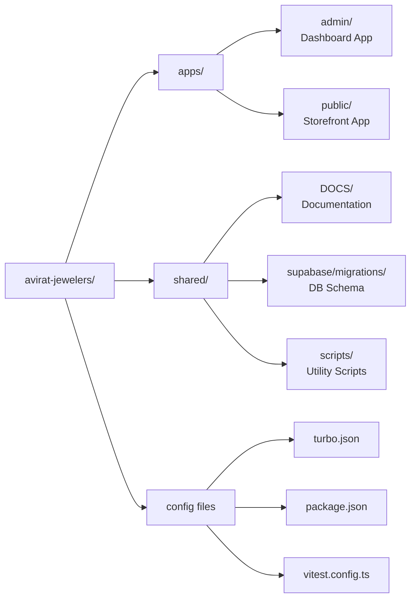

# Avirat Jewelers - E-Commerce Platfor

A modern, full-stack jewelry e-commerce platform built for Avirat Jewelers, a local jewelry store in Gujarat, India. This dual-application system provides a public-facing storefront and an admin dashboard for comprehensive product and inquiry management.



## 🏗️ Architecture Overview

### High-Level Architecture



### Data Flow Architecture



### Monorepo Structure



## 🎯 Project Overview

### Business Purpose
Avirat Jewelers is a local jewelry store that needed to expand its reach beyond word-of-mouth and foot traffic. This platform serves as a digital storefront to:
- Showcase jewelry products with detailed information
- Capture customer inquiries for follow-up
- Enable easy inventory management for store staff
- Provide real-time updates between admin changes and public display

### Core Applications

#### 1. Public Site (`apps/public`)
- **Purpose:** Customer-facing storefront
- **Key Features:**
  - Product catalog with filtering and search
  - Category-based browsing
  - Offer/discount display
  - Inquiry submission forms
  - Real-time product updates
  - Responsive mobile-first design

#### 2. Admin Dashboard (`apps/admin`)
- **Purpose:** Store management interface
- **Key Features:**
  - Product CRUD operations
  - Category management
  - Offer/discount management
  - Inquiry management
  - Analytics dashboard
  - Metal price management
  - Festival and banner management
  - Image upload management

## 🛠️ Technology Stack

### Frontend Framework
- **Next.js 16.x** - React framework with App Router
- **React 19.x** - UI library
- **TypeScript 5.x** - Type-safe development
- **Tailwind CSS 4.x** - Utility-first CSS framework

### Backend & Database
- **Supabase** - Backend-as-a-Service
  - PostgreSQL database
  - File storage
  - Realtime subscriptions
  - Row-level security (RLS)
- **Firebase Auth** - Admin authentication
- **Next.js API Routes** - Serverless API endpoints

### Development Tools
- **Turborepo** - Monorepo management
- **Vitest** - Unit testing framework
- **React Testing Library** - Component testing
- **Playwright** - E2E testing
- **ESLint** - Code linting
- **TypeScript** - Static type checking

### External Services
- **Metal Price APIs** - Gold/silver price data
- **GeoIP Services** - Location-based services

## 📁 Project Structure

```
avirat-jewelers/
├── apps/
│   ├── admin/                    # Admin dashboard application
│   │   ├── src/
│   │   │   ├── app/              # Next.js App Router pages
│   │   │   ├── components/       # React components
│   │   │   ├── lib/              # Utility libraries
│   │   │   └── hooks/            # Custom React hooks
│   │   └── package.json
│   │
│   └── public/                   # Public storefront application
│       ├── src/
│       │   ├── app/              # Next.js App Router pages
│       │   ├── components/       # React components
│       │   ├── lib/              # Utility libraries
│       │   ├── hooks/            # Custom React hooks
│       │   └── types/            # TypeScript types
│       └── package.json
│
├── supabase/
│   └── migrations/               # Database schema migrations
│
├── DOCS/                         # Project documentation
│   ├── avirat-jewelers-prd.md
│   ├── avirat-jewelers-api-design.md
│   └── [other documentation]
│
├── package.json                  # Root package.json
├── turbo.json                    # Turborepo configuration
├── tsconfig.json                 # Root TypeScript config
├── vitest.config.ts              # Vitest testing configuration
└── diagram.png                   # System architecture diagram
```

## 🗄️ Database Overview

### Core Data Models

The application uses a relational database with the following main entities:

- **Products** - Jewelry product information
- **Categories** - Product categorization
- **Offers & Discounts** - Promotional system
- **Inquiries** - Customer inquiries
- **Visits** - Analytics tracking
- **Festivals & Banners** - Seasonal promotions
- **Metal Prices** - Daily metal pricing data

### Database Features
- Row-level security (RLS) for access control
- Real-time subscriptions for live updates
- Automated price calculations
- Comprehensive audit trails

**Note:** Detailed schema information is available in `DOCS/avirat-jewelers-schema-diagram.md` for authorized developers.

## 🔌 API Overview

### Admin API Routes

#### Product Management
- Product CRUD operations
- Image upload handling
- Bulk operations
- Status management

#### Inventory Control
- Category management
- Offer/discount system
- Festival management
- Banner management

#### Analytics & Operations
- Analytics data
- Metal price management
- Inquiry management

### Public API Routes

#### Product Discovery
- Product listing with filters
- Product details
- Category browsing
- Search functionality

#### User Interactions
- Inquiry submission
- Visit tracking
- Metal price data

#### Content Delivery
- Active offers
- Banners
- Festival content

**Note:** Detailed API documentation is available in `DOCS/avirat-jewelers-api-design.md` for authorized developers.

## ✨ Key Features

### Public Site Features

#### Product Discovery
- Visual product showcase
- Advanced filtering and search
- Real-time updates
- Offer display with automatic calculations

#### User Experience
- Mobile-first design
- Fast loading with SSR
- SEO optimized
- Trust signals and certifications
- Easy inquiry submission

#### Visual Design
- Elegant jewelry aesthetic
- Responsive layouts
- Interactive elements
- Promotional content system

### Admin Dashboard Features

#### Product Management
- Complete CRUD operations
- Multi-image upload
- Bulk operations
- Data validation
- Status workflow management

#### Inventory Control
- Dynamic category system
- Promotional offer system
- Seasonal collections
- Banner management

#### Analytics & Insights
- Visit tracking
- Inquiry management
- Price trends
- Performance metrics

#### Automation
- Automatic price updates
- Real-time synchronization
- Data quality checks
- Error management

## 🚀 Getting Started

### Prerequisites

- Node.js 18+ 
- npm or yarn
- Supabase account
- Firebase project (for admin auth)
- Git

### Installation

1. **Clone the repository**
```bash
git clone <repository-url>
cd KTECH_PROJECT_003
```

2. **Install dependencies**
```bash
npm install
```

3. **Set up environment variables**

Create `.env.local` files in both apps with required credentials:

**Public App (`apps/public/.env.local`):**
```env
NEXT_PUBLIC_SUPABASE_URL=your_supabase_url
NEXT_PUBLIC_SUPABASE_ANON_KEY=your_supabase_anon_key
```

**Admin App (`apps/admin/.env.local`):**
```env
NEXT_PUBLIC_SUPABASE_URL=your_supabase_url
NEXT_PUBLIC_SUPABASE_ANON_KEY=your_supabase_anon_key
SUPABASE_SERVICE_ROLE_KEY=your_service_role_key
# Firebase configuration variables
NEXT_PUBLIC_FIREBASE_API_KEY=your_firebase_api_key
NEXT_PUBLIC_FIREBASE_AUTH_DOMAIN=your_firebase_auth_domain
NEXT_PUBLIC_FIREBASE_PROJECT_ID=your_firebase_project_id
# Additional Firebase config...
```

**⚠️ Security Note:** Never commit `.env` files. Use environment variable management in your deployment platform.

4. **Set up database**
```bash
# Apply database migrations via Supabase Dashboard or CLI
# Refer to internal documentation for detailed instructions
```

5. **Create storage buckets**
```bash
# Create required storage buckets with proper permissions
# Refer to internal documentation for detailed instructions
```

### Development

Start development servers:

```bash
# Start both apps
npm run dev

# Start admin app only
cd apps/admin
npm run dev

# Start public app only
cd apps/public
npm run dev
```

- **Admin Dashboard:** http://localhost:3001
- **Public Site:** http://localhost:3002

### Building

```bash
# Build both apps
npm run build

# Build specific app
cd apps/admin  # or apps/public
npm run build
```

## 🧪 Testing

### Test Structure

Current test coverage:
- **Overall:** ~70% statements, ~76% branches
- **Admin App:** ~95% statements, ~90% branches
- **Public App:** ~48% statements, ~50% branches

### Running Tests

```bash
# Run all tests
npm run test

# Run tests in watch mode
npm run test:watch

# Run tests with coverage
npm run test:coverage
```

### Test Coverage

Detailed test coverage analysis is available in `TEST_COVERAGE_REPORT.md` for authorized developers.

## 📦 Deployment

### Deployment Process

1. **Environment Setup**
   - Configure all required environment variables
   - Set up production database
   - Configure storage buckets
   - Set up CORS policies

2. **Build & Deploy**
   - Build applications for production
   - Deploy to chosen platform (Vercel, etc.)
   - Configure domain settings
   - Set up monitoring

**Note:** Detailed deployment instructions are available in internal documentation for authorized developers.

### Environment Variables

All sensitive configuration is managed through environment variables. Refer to `DOCS/ENVIRONMENT_VARIABLES.md` for the complete list of required variables and setup instructions.

## 🔒 Security

### Authentication
- **Admin:** Firebase Auth with session timeout
- **Public:** No authentication required
- **API:** Service role key for admin operations

### Data Access
- **Row Level Security (RLS):** Fine-grained access control
- **API Keys:** Separate anon and service role keys
- **CORS:** Configured for allowed domains
- **Rate Limiting:** API rate limiting for public endpoints

### Security Best Practices
- ✅ Never commit `.env` files or secrets
- ✅ Use environment variables for all sensitive data
- ✅ Regular security audits
- ✅ Keep dependencies updated
- ✅ Implement proper error handling
- ✅ Use HTTPS in production
- ✅ Regular backup verification

## 📊 Monitoring & Analytics

### Built-in Analytics
- Page visit tracking
- Product view analytics
- Inquiry submission tracking
- Popular products identification

### External Monitoring
- Platform-specific analytics (Vercel, etc.)
- Database metrics via Supabase Dashboard
- Authentication metrics via Firebase Console

## 🛠️ Maintenance

### Database Maintenance
- Regular backup verification
- Index optimization
- RLS policy audits
- Storage cleanup

### Code Maintenance
- Dependency updates
- Security patching
- Performance optimization
- Code refactoring

### Content Management
- Product catalog updates
- Price adjustments
- Offer management
- Banner updates

## 📚 Documentation

### Available Documentation
- `DOCS/avirat-jewelers-prd.md` - Product Requirements Document
- `DOCS/avirat-jewelers-api-design.md` - API Design Document
- `DOCS/avirat-jewelers-schema-diagram.md` - Database Schema
- `DOCS/ENVIRONMENT_VARIABLES.md` - Environment Setup Guide
- `DOCS/DATABASE_MIGRATION_GUIDE.md` - Database Migration Guide
- `DOCS/STORAGE_BUCKET_GUIDE.md` - Storage Setup Guide
- `DOCS/CORS_CONFIGURATION.md` - CORS Configuration Guide
- `DOCS/PRODUCTION_READINESS_SUMMARY.md` - Production Readiness Checklist
- `TEST_COVERAGE_REPORT.md` - Test Coverage Analysis

**Note:** Some documentation contains sensitive information and is intended for authorized developers only.

## 🤝 Contributing

### Development Workflow
1. Create feature branch from main
2. Make changes with tests
3. Ensure all tests pass
4. Submit pull request
5. Code review and approval
6. Merge to main

### Code Style
- Follow existing code patterns
- Use TypeScript for type safety
- Write tests for new features
- Update documentation
- Follow security best practices

## 🐛 Troubleshooting

### Common Issues

#### Database Connection
- Verify credentials in environment variables
- Check RLS policies
- Ensure network connectivity

#### Authentication
- Verify Firebase configuration
- Check service account permissions
- Validate token handling

#### Image Upload
- Check storage bucket permissions
- Verify file size limits
- Ensure CORS configuration

#### Realtime Updates
- Verify realtime service enabled
- Check subscription filters
- Ensure proper cleanup

## 📞 Support

For technical support or questions:
- Review documentation in `DOCS/` directory
- Check internal issue tracking
- Contact development team

## 📄 License

Proprietary - All rights reserved by Ktech

---

**Built with ❤️ for KTECH**
